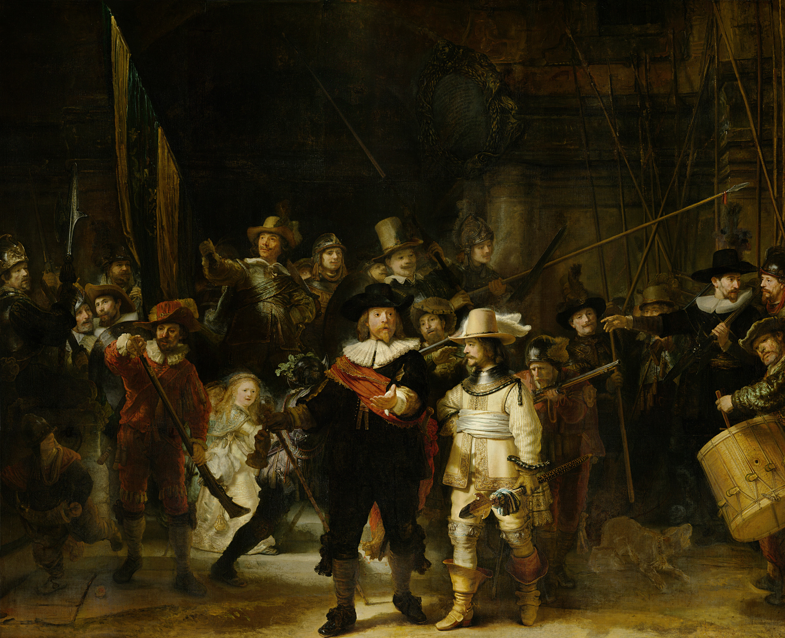
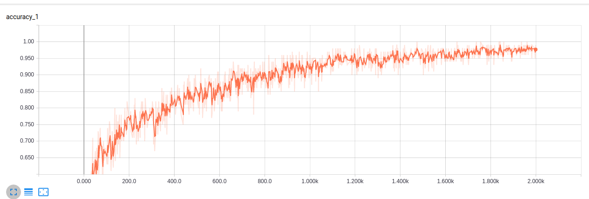
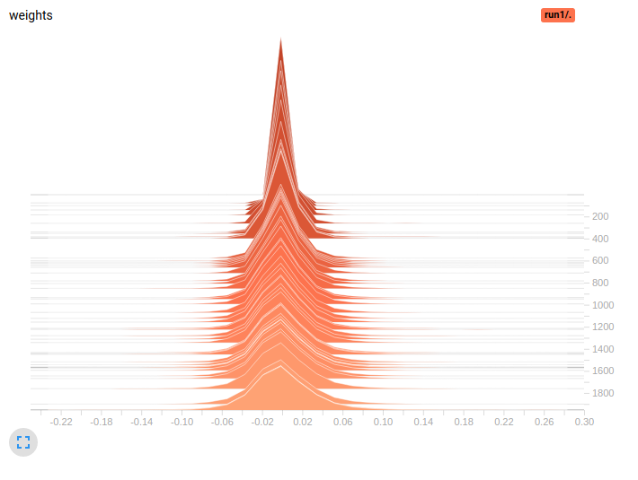
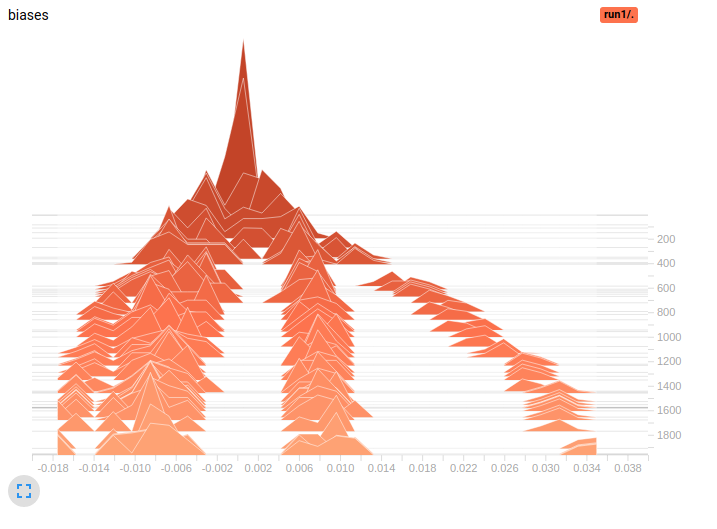

# CNN for Art Classification

The network is trained to classify the art of the following 10 artists:
**Bernard Picart**, **George Hendrik Breitner**, **Isaac Israels**, **Jan
Luyken**, **Johannes Tavenraat**, **Marius Bauer**, **Reinier Vinkeles**,
**Rembrandt Harmensz van Rijn**, **Simon Fokke**, **Willem Witsen**. It extends
the research done by Stanford at
http://cs231n.stanford.edu/reports/2017/pdfs/410.pdf

The network is based on the imagenet "inception-model" and is retrained on 1000
images of artwork, 100 from each artist.

# Sample Images





# Program

```python
import os
import urllib
import tarfile
import re
import random
import hashlib
import math

import tensorflow as tf
from tensorflow.python.util import compat
import numpy as np
import matplotlib.pyplot as plt
```

```python
inception_url = 'http://download.tensorflow.org/models/image/imagenet/inception-2015-12-05.tgz'
inception_dir_filepath = './inception/'
inception_filepath = inception_dir_filepath + 'classify_image_graph_def.pb'
train_graph_dir_filepath = './train'
input_tensor_name = 'Mul:0'
second_last_tensor_name = 'pool_3/_reshape:0'
second_last_tensor_size = 2048
MAX_NUM_IMAGES_PER_CLASS = 2 ** 27 - 1

num_training_steps = 2000
train_batch_size = 100
eval_step_interval = 10
testing_percentage = 20
validation_percentage = 20
```

`NeuralNetwork` is the main class in the project so many of the key functions
are in this class.

```python
class NeuralNetwork(object):
    def __init__(self, images_dict):
        self.images_dict = images_dict
        graph = tf.Graph()

        with graph.as_default():
            with tf.gfile.FastGFile(inception_filepath, 'rb') as f:
                graph_def = tf.GraphDef()
                graph_def.ParseFromString(f.read())
                self.input_tensor, bottleneck_input = tf.import_graph_def(graph_def, name='', return_elements=[input_tensor_name, second_last_tensor_name])

        self.session = tf.Session(graph=graph)

        with self.session as sess:
            self.jpeg_data_tensor, self.decoded_image_tensor = self.add_jpeg_decoding(299, 299, 3, 128, 128)
            self.add_final_layer(bottleneck_input, len(self.images_dict.keys()))
            self.add_evaluation_step()

            self.merged = tf.summary.merge_all()
            if not os.path.exists(train_graph_dir_filepath):
                os.makedirs(train_graph_dir_filepath)
            self.train_writer = tf.summary.FileWriter(train_graph_dir_filepath, graph)

            init = tf.global_variables_initializer()
            sess.run(init)

            self.layer = graph.get_tensor_by_name('conv:0')
            for i in graph.get_operations():
                print(i.values())

            self.train_network(num_training_steps)
            
    # the art images are in jpeg format which our network cannot use directly, so we decode the image into a useable format     
    def add_jpeg_decoding(self, input_width, input_height, input_depth, input_mean, input_std):
        jpeg_data = tf.placeholder(tf.string, name='decode_jpg_input')
        decoded_image = tf.image.decode_jpeg(jpeg_data, channels=input_depth)
        decoded_image_as_float = tf.cast(decoded_image, dtype=tf.float32)
        decoded_image_4d = tf.expand_dims(decoded_image_as_float, 0)
        resize_shape = tf.stack([input_height, input_width])
        resize_shape_as_int = tf.cast(resize_shape, dtype=tf.int32)
        resized_image = tf.image.resize_bilinear(decoded_image_4d,
                                               resize_shape_as_int)
        offset_image = tf.subtract(resized_image, input_mean)
        mul_image = tf.multiply(offset_image, 1.0 / input_std)

        return jpeg_data, mul_image
    
    # the pre-trained inception model does not have a final layer, so we must add one suitable for artist classification
    def add_final_layer(self, bottleneck_input, class_count):
        self.bottleneck_tensor = tf.placeholder_with_default(bottleneck_input, shape=[None, second_last_tensor_size], name='input_placeholder')
        self.ground_truth_tensor = tf.placeholder(tf.float32, [None, class_count], name='ground_truth_input')

        layer_weights = tf.Variable(tf.truncated_normal([second_last_tensor_size, class_count], stddev=0.001), name='final_weights')
        layer_biases = tf.Variable(tf.zeros([class_count]), name='final_biases')

        logits = tf.add(tf.matmul(self.bottleneck_tensor, layer_weights), layer_biases)

        self.final_tensor = tf.nn.softmax(logits, name='final_result')

        with tf.name_scope('cross_entropy'):
            cross_entropy = tf.nn.softmax_cross_entropy_with_logits(labels=self.ground_truth_tensor, logits=logits)
            with tf.name_scope('total'):
                cross_entropy_mean = tf.reduce_mean(cross_entropy)
        tf.summary.scalar('cross_entropy', cross_entropy_mean)

        with tf.name_scope('train'):
            optimizer = tf.train.GradientDescentOptimizer(0.01)
            self.train_step = optimizer.minimize(cross_entropy_mean)
            
    # used to evaluate the accuracy of the model
    def add_evaluation_step(self):
        with tf.name_scope('accuracy'):
            with tf.name_scope('correct_prediction'):
                self.prediction = tf.argmax(self.final_tensor, 1)
                correct_prediction = tf.equal(self.prediction, tf.argmax(self.ground_truth_tensor, 1))
            self.evaluation_step = tf.reduce_mean(tf.cast(correct_prediction, tf.float32))

        tf.summary.scalar('accuracy', self.evaluation_step)
        
    # used to train the model by randomly fetching a train_batch_size amount of images for num_training_steps
    def train_network(self, num_training_steps):
        print("Starting...")

        for i in range(num_training_steps):
            train_bottlenecks, train_ground_truths = self.get_tensors_for_training('training')

            train_summary, _ = self.session.run([self.merged, self.train_step], feed_dict={self.bottleneck_tensor: train_bottlenecks, self.ground_truth_tensor: train_ground_truths})
            self.train_writer.add_summary(train_summary, i)

            if (i % eval_step_interval) == 0:
                train_accuracy = self.session.run([self.evaluation_step], feed_dict={self.bottleneck_tensor: train_bottlenecks, self.ground_truth_tensor: train_ground_truths})[0]
                print('Step %d: Train accuracy = %.1f%%' % (i, train_accuracy * 100))

        test_bottlenecks, test_ground_truths = self.get_tensors_for_testing('testing')
        test_accuracy, predictions = self.session.run([self.evaluation_step, self.prediction], feed_dict={
            self.bottleneck_tensor: test_bottlenecks, self.ground_truth_tensor: test_ground_truths})
        print('Final test accuracy = %.1f%% (N=%d)' % (test_accuracy * 100, len(test_bottlenecks)))

        self.getActivations()
        
    def get_tensors_for_training(self, category):
        class_count = len(self.images_dict.keys())
        tensor_inputs, ground_truth_inputs = [], []

        for unused_i in range(train_batch_size):
            label_index = random.randrange(class_count)
            label_name = list(self.images_dict.keys())[label_index]

            image_index = random.randrange(MAX_NUM_IMAGES_PER_CLASS + 1)
            image_path = self.get_image_path(label_name, image_index, category)
            image_data = tf.gfile.FastGFile(image_path, 'rb').read()
            tensor_input = self.run_bottleneck_on_image(image_data)

            ground_truth_input = np.zeros(class_count, dtype=np.float32)
            ground_truth_input[label_index] = 1.0

            tensor_inputs.append(tensor_input)
            ground_truth_inputs.append(ground_truth_input)

        return tensor_inputs, ground_truth_inputs
    
    def get_tensors_for_testing(self, category):
        class_count = len(self.images_dict.keys())
        bottlenecks, ground_truths = [], []
        for label_index, label_name in enumerate(self.images_dict.keys()):
            for image_index, image_name in enumerate(self.images_dict[label_name][category]):
                image_path = self.get_image_path(label_name, image_index, category)
                image_data = tf.gfile.FastGFile(image_path, 'rb').read()
                bottleneck = self.run_bottleneck_on_image(image_data)

                ground_truth = np.zeros(class_count, dtype=np.float32)
                ground_truth[label_index] = 1.0

                bottlenecks.append(bottleneck)
                ground_truths.append(ground_truth)

        return bottlenecks, ground_truths
    
    def get_image_path(self, label_name, index, category):
        label_lists = self.images_dict[label_name]
        category_list = label_lists[category]
        mod_index = index % len(category_list)
        base_name = category_list[mod_index]
        full_path = os.path.join('./dataset', label_name, base_name)
        return full_path
    
    def run_bottleneck_on_image(self, image_data):
        # First decode the JPEG image, resize it, and rescale the pixel values.
        resized_input_values = self.session.run(self.decoded_image_tensor, {self.jpeg_data_tensor: image_data})
        # Then run it through the recognition network.
        bottleneck_values = self.session.run(self.bottleneck_tensor, {self.input_tensor: resized_input_values})
        bottleneck_values = np.squeeze(bottleneck_values)
        return bottleneck_values
    
    def getActivations(self):
        image_path = self.get_image_path(list(self.images_dict.keys())[0], 0, 'validation')
        image_data = tf.gfile.FastGFile(image_path, 'rb').read()
        resized_input_values = self.session.run(self.decoded_image_tensor, {self.jpeg_data_tensor: image_data})

        units = self.session.run(self.layer, {self.input_tensor: resized_input_values})
        self.plotNNFilter(units)
        
    def plotNNFilter(self, units):
        filters = units.shape[3]
        plt.figure(1, figsize=(20,20))
        n_columns = 6
        n_rows = math.ceil(filters / n_columns) + 1

        for i in range(filters):
            plt.subplot(n_rows, n_columns, i+1)
            plt.title('Filter ' + str(i))
            plt.imshow(units[0,:,:,i], interpolation="nearest", cmap="gray")
        plt.savefig('filters.png')
```

```python
# create arrays of training and testing images
def initialize_images():
    images_dict = {}
    artist_dirs = [x[0] for i, x in enumerate(os.walk('./dataset')) if i != 0]

    for artist_dir in artist_dirs:
        artist_name = os.path.basename(artist_dir)
        artist_images = filter(lambda f: f.split('.')[-1] in ['jpg', 'jpeg', 'JPG', 'JPEG'], os.listdir(artist_dir))

        validation_images, testing_images, training_images = [], [], []

        for artist_image in artist_images:
            base_name = os.path.basename(artist_image)
            hash_name = re.sub(r'_nohash_.*$', '', base_name)
            hash_name_hashed = hashlib.sha1(compat.as_bytes(hash_name)).hexdigest()
            percentage_hash = ((int(hash_name_hashed, 16) % (MAX_NUM_IMAGES_PER_CLASS + 1)) * (100.0 / MAX_NUM_IMAGES_PER_CLASS))

            if percentage_hash < validation_percentage:
                validation_images.append(base_name)
            elif percentage_hash < (testing_percentage + validation_percentage):
                testing_images.append(base_name)
            else:
                training_images.append(base_name)

        images_dict[artist_name] = {
            'training': training_images,
            'testing': testing_images,
            'validation': validation_images
        }

    return images_dict
```

We the run script starting with `initialize_images` and `initialize_model`. For
the purposes of this notebook however we have commented out the call to start
the program. 

Running it would re-train the entire network which takes several
hours.

Instead the output is replicated below.

```python
if __name__ == '__main__':
    # model = initialize_model(initialize_images())
    pass
```

# Training and Testing

```
Starting...
Step 0: Train accuracy = 16.0%
Step 10: Train accuracy = 42.0%
Step 20: Train accuracy = 65.0%
Step 30: Train accuracy = 61.0%
Step 40: Train
accuracy = 69.0%
Step 50: Train accuracy = 65.0%
Step 60: Train accuracy = 73.0%
Step 70: Train accuracy = 69.0%
Step 80: Train accuracy = 82.0%
Step 90: Train
accuracy = 70.0%
Step 100: Train accuracy = 66.0%
...
Step 1900: Train accuracy
= 98.0%
Step 1910: Train accuracy = 96.0%
Step 1920: Train accuracy = 97.0%
Step
1930: Train accuracy = 98.0%
Step 1940: Train accuracy = 99.0%
Step 1950: Train
accuracy = 96.0%
Step 1960: Train accuracy = 98.0%
Step 1970: Train accuracy =
96.0%
Step 1980: Train accuracy = 97.0%
Step 1990: Train accuracy = 97.0%
Final
test accuracy = 70.7% (N=198)
```

# Accuracy and Cross Entropy

We can see from the graph below that accuracy against the training data rises
sharply during training, then gradually approaches 100%.



Cross entropy trends approximately inversely to accuracy as we would expect.


# Weights and Biases

The plots below represent how the model's weights and biases changed during
training. 

Each plot is made of many histograms. The ones further in the
"background" of the image are the older histograms, the foreground histograms
are more recent in training.

We can see that the weights start out very uniform as we expect, and then the
distribution widens during training.



The change to the biases during training is more pronounced. The distribution
becomes divided into approximately three modes.



# Activation Maps

Below are the activation maps for various filters for a given input image.


---


---


